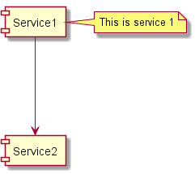

#### Contents

- [Placeholder](#placeholder)
- [How to write diagrams](#how-to-write-diagrams)
- [Instructions to generate diagrams](#instructions-to-generate-diagrams)

#### Placeholder


#### How to write diagrams

Diagrams are written in [Plant UML](http://plantuml.com/) - full instructions on the website linked.

[Atom](https://atom.io) has two good packages for it

 - [PlantUML language](https://atom.io/packages/language-plantuml)
 - [PlantUML viewer](https://atom.io/packages/plantuml-viewer)

The viewer lets you see updates in real time to the diagram as you write it

#### Instructions to generate diagrams

Once you've written your diagram you'll want to add it to the `readme.md` file.

To automatically generate the diagrams and add them to the readme file you need to run `gulp update-diagrams`

```sh
# You need to have graphviz installed to generate diagrams

# if you're a windows guy
choco install javaruntime
choco install graphviz

# if you're a mac guy
brew install graphviz

# Add the path to your environment variables
# C:\Program Files (x86)\Graphviz2.38\bin

# Install gulp globally
npm install -g gulp

# running the following batch file will update the diagrams
gulp update-diagrams
```
